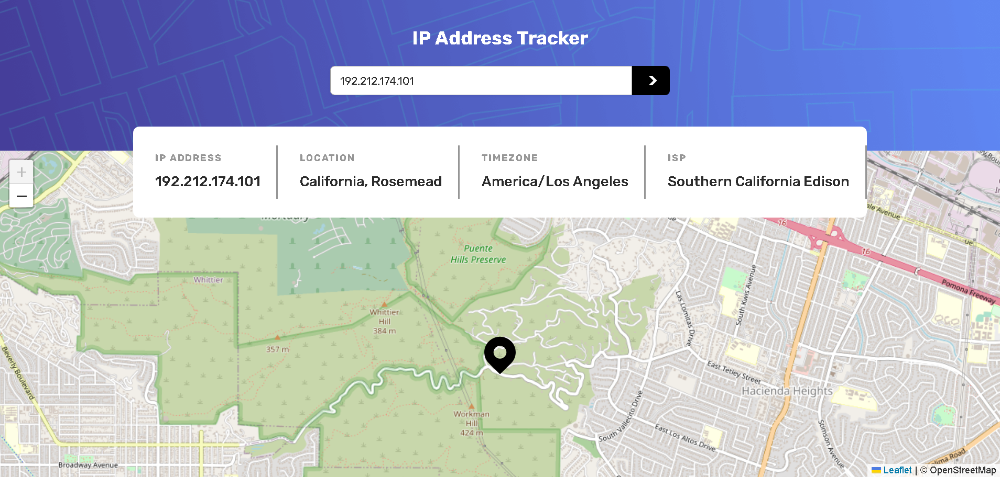

# IP Address Tracker

La idea de este proyecto fue brindada por [Frontend Mentor](https://www.frontendmentor.io), es una página web que nos muestra la ubicación de diferentes IP que sean de dominio público, este proyecto no interactúa con direcciones IP privadas o protegidas.

## Vista previa



## Funcionalidades

_Visualizar ubicación de IP pública más cercana:_ Al ingresar a la página por primera vez, se mostrará la ubicación de la IP pública más cercana.

_Visualizar ubicación de IP ingresada:_ Al ingresar una IP válida en el campo de búsqueda, se mostrará la ubicación de la IP ingresada, si es de dominio público, la precisión de la ubicación dependerá de la API #2.

_Visualizar información de IP ingresada:_ Al ingresar una IP válida en el campo de búsqueda, se mostrará la información relevante de la IP ingresada si es de dominio público.

## API's utilizadas

- [API #1 (ipify API)](https://api.ipify.org/?format=json) para conseguir la dirección IP publica más cercana.
- [API #2 (ipinfo.io)](https://ipinfo.io/) para conseguir información útil sobre las diferentes direcciones IP.
- [API #3 (OpenStreetMap)](https://www.openstreetmap.org/) para dibujar el mapa.

## Comenzando 

1. Clona este repositorio en tu máquina local o descargar la carpeta comprimida del proyecto:

   ```bash
   git clone https://github.com/drifterDev/ip-address-tracker.git
   ```

### Prerrequisitos 

Antes de comenzar, asegúrate de tener instalado `npm` en tu sistema. Si no lo tienes instalado, puedes descargarlo e instalarlo desde [el sitio web oficial de Node.js](https://nodejs.org/).

También es necesario registrarse y obtener un Token de acceso en la API #2. Al conseguir el Token de acceso para usar la API se debe pegar en el archivo src/script.js

### Instalación 

1. Descargar las dependencias necesarias del proyecto:

   ```bash
   npm install
   ```

2. Correr el comando para generar el CSS debido al framework TailwindCSS:

   ```bash
   npm run build
   ```

3. El archivo principal o punto de entrada está en la carpeta src/ y es el index.html.

4. Abrir el navegador de preferencia y abrir el archivo index.html.

## Construido con 

* [TailwindCSS](https://tailwindcss.com/) - El framework CSS usado
* [JavaScript](https://developer.mozilla.org/es/docs/Web/JavaScript) - Lenguaje de programación usado

## Contribuyendo 

Aprecio cualquier sugerencia para mejorar el contenido de este proyecto. Si deseas contribuir, por favor crea un "issue" en el repositorio o contáctame directamente. Valoraré tus aportes para mejorar este repositorio.

## Licencia 

Los códigos incluidos en este proyecto están bajo la Licencia MIT. Para obtener más información, consulta el archivo [LICENSE](LICENSE) en la raíz del repositorio.

## Licencia de API's

OpenStreetMap® es datos abiertos, licenciada bajo los términos de [Licencia de bases de datos abiertas de Open Data Commons](https://opendatacommons.org/licenses/odbl/) (ODbL) por la [Fundación OpenStreetMap](https://wiki.osmfoundation.org/wiki/Main_Page)

Eres libre de copiar, distribuir, transmitir y adaptar nuestros datos libremente siempre y cuando des reconocimiento a OpenStreetMap y sus colaboradores. Si modificas o te basas en nuestros datos, solo podrás distribuir el resultado bajo la misma licencia. El código legal completo explica tus derechos y responsabilidades.

Nuestra documentación está licenciada bajo los términos de [Creative Commons Atribución-CompartirIgual 2.0](https://creativecommons.org/licenses/by-sa/2.0/deed.es) (CC BY-SA 2.0).